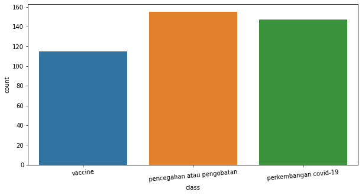
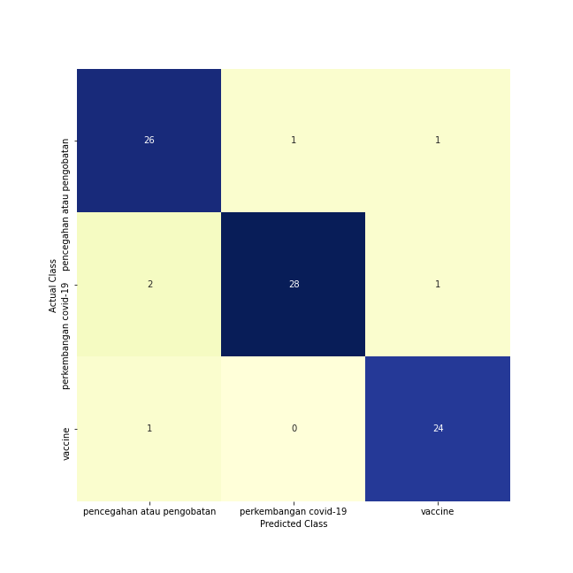

# Covid-19-Tweets-Classification
**Classification of Covid-19 Tweets** using **Multinomial Naive Bayes** and **TF-IDF Vectorizer** to categorize tweets into **three** main classes: **"Vaccine"** (Vaksin), **"Prevention and treatment of covid-19"** (Pencegahan dan pengobatan), and **"Current development of covid-19 in Indonesia"** (Perkembangan covid di Indonesia).

## About the Project

**Covid-19** is a global virus pandemic affecting people worldwide. The virus spreads quickly through droplets from infected individuals. The Covid-19 pandemic has significantly affected societal life. Discussions range from health protocols and symptoms to daily reports of cases and vaccine development. Social and economic consequences are also widely discussed.

Twitter, a major social media platform, is a prominent space for discussions. Users share information through tweets, contributing to a vast array of discussions on COVID-19, like **health protocols, symptoms, daily case reports, vaccine development,** and **socio-economic impacts**. Due to the large volume of discussions on Twitter, a classification system is essential. This system helps analyze and understand the prevalent topics related to the Covid-19 pandemic.

## Objectives/ Problems

This project is a major assignment project for the first semester of the **natural language processing** course. The objective of this task is to crawl data related to COVID-19 on the Twitter platform with a minimum amount of data per class of 100, then classify the text based on the data obtained in these 3 classes.

The 3 classes used in this project are:
- **"Vaccine"** (Vaksin),
- **"Prevention and treatment of covid-19"** (Pencegahan dan pengobatan), and
- **"Current development of covid-19 in Indonesia"** (Perkembangan covid di Indonesia)

In this project, we use **Multinomial Naive Bayes** algorithm to perform text classification and **TF-IDF Vectorizer** as Word Embedding (to convert text data into vectors).

## Technology Used
* Python
* Pandas
* Matplotlib
* Seaborn
* Scikit-learn
* Sastrawi
* Tweepy

## Notebook File
* [covid-19-tweets-classification.ipynb](notebooks/covid-19-tweets-classification.ipynb)

## Workflow

### Data Collection
  - The dataset used in this project comprises tweet data acquired from the **Twitter** platform using the **Tweepy** library. The data was collected based on the following keywords:
    - **"Vaccine"** (Vaksin),
      - "vaksin astrazeneca"
      - "vaksin sinovac"
      - "vaksin sinopharm"
    - **"Prevention and treatment of covid-19"** (Pencegahan dan pengobatan), and
      - "pencegahan covid-19"
      - "pengobatan covid-19"
      - "pencegahan corona"
      - "pengobatan corona"
    - **"Current development of covid-19 in Indonesia"** (Perkembangan covid di Indonesia)
      - "perkembangan covid-19"
      - "covid-19 di Indonesia"
      - "covid-19 berkembang"
  - **The quantity of collected data is:**
    - "Vaccine": **115** Tweets
    - "Prevention and treatment of covid-19": **155** Tweets
    - "Current development of covid-19 in Indonesia": **147** Tweets
    - Total: **417** tweets
  - **Data distribution:**

    

### Data Preprocessing
  The data preprocessing steps applied to the data include:
  - Remove **hashtag, @user, and hyperlink** from the tweet
  - **Stopword removal** using **Sastrawi** library
  - Train the **TF-IDF Vectorizer** model

### Data Splitting
  - The data is split into **training data** and **testing data** with a ratio of 0.2, signifying **80% for training data** and **20% for testing data**. The random_state variable is set to 0.

### Model Building & Training
  - The model is trained using the **Multinomial Naive Bayes** algorithm
  - The trained model is saved to: [models/MNB_model.sav](models/MNB_model.sav)

### Model Evaluation
  - Confusion Matrix:

    
  
  - Accuracy Score:
    - 0.9285714285714286 (**92.86%**)

## Publication
* [Klasifikasi Tweet Mengenai COVID-19.pdf](docs/PBA%20Tugas%20Besar%20-%20Kelompok%202.pdf)

## Contributors
* [Linggar Maretva Cendani](https://github.com/LinggarM) - [linggarmc@gmail.com](mailto:linggarmc@gmail.com)

## License
This project is licensed under the MIT License - see the [LICENSE](LICENSE) file for details
